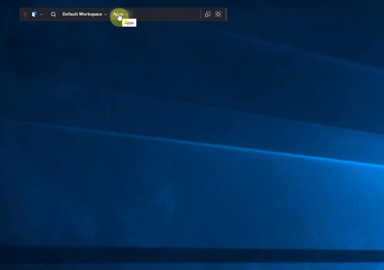

## Spawning a tabbed window of Components into your Workspace ##
You may wish to spawn a group of components into a single tabbed window. This is recipe demonstrates how to achieve that with the Finsemble LauncherClient API.



### Spawning a tabbed group ###
[spawnTabbedGroup.js](./spawnTabbedGroup.js) provides a utility function that allows you to spawn a group of components, group them intoa tabbed window and (optionally) add them to a common linker channel. This is achieved by providing an array of String componentTypes to spawn and a set of spawn parameters to position the tabbed window. 

#### Setting a Linker group ####
The components spawned can all be added to the same group on spawn by specifying that group as the final argument to the commend. Alternatively, specify 'auto' to automatically select an unused linker group (or if none is available the least used group).

#### Example usage: ####
```
let let toSpawn = ["Welcome Component","Welcome Component","Welcome Component"];
let promise = spawnTabbedGroup(toSpawn, {top: 100, left: 200, width: 800, height: 600}}, 'auto');
```

The `spawnTabbedGroup()` function can be integrated into your project in a variety of ways, for example, call it from a service or other component when you need to spawn your group. 

### Spawning a tabbed window from the Launcher menu ###
[tabbedGroupSpawner.js](./tabbedGroupSpawner.js) provides an example of using `spawnTabbedGroup()` to spawn your tabbed window from the Launcher menu. This is achieved by creating a dummy component with `window.options.autoShow: false` set in its config, which then spawns the group. A single, simple component implementation can be used to spawn multiple different types of tabbed window by providing the  config as spawnData, allowing you to define the tabbed window in your normal _/configs/application/components.json_ file. See [config.json](./config.json) for example tabbed groups.

### Installation ###
To install and run the spawnTabbedGroup examples please follow the instructions below. However, please note that you can import [spawnTabbedGroup.js](./spawnTabbedGroup.js) into your own code to spawn tabbed windows from services or other components.

1. Add the `tabbedGroupSpawner` component folder to your _/src/components_ directory.
2. Add the component to your webpack build at _/build/webpack/webpack.components.entries.json_: 
```
{
    ...
    "tabbedGroupSpawner": {
        "output": "components/tabbedGroupSpawner/tabbedGroupSpawner",
        "entry": "./src/components/tabbedGroupSpawner/tabbedGroupSpawner.js"
    }
    ...
}
```
3. Either add the configuration in [config.json](./config.json) to your _/configs/application/components.json_ file OR import it in your _/configs/application/config.json_ file:
```
	...,
	"importConfig": [
		...,
		"$applicationRoot/components/tabbedGroupSpawner/config.json"
	]
```
4. Build and run Finsemble and try launching the example tabbed window from the Launcher menu.
